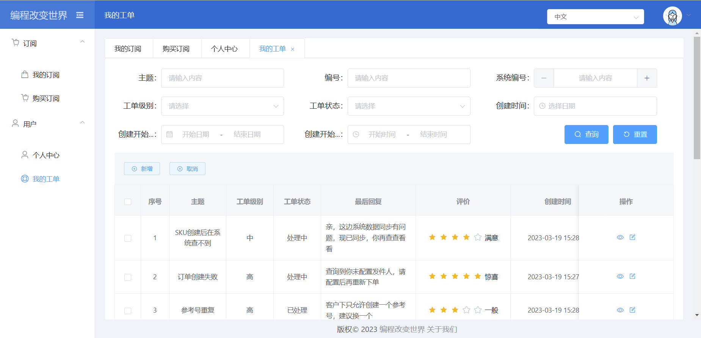

# vue-cli-admin
Vue CLI快速启动，前端基本架构模型
- 菜单加载
- 动态路由
- 动态加载国际化
- 请求拦截
- 统一API
- 返回提示

## Preview



## Project setup
```
// 安装依赖
npm install
// 前端服务
npm run serve
// 后台服务
node server.local.js
```

## Quick start
```
// 安装Node.js

// 配置淘宝镜像
npm config set registry https://registry.npm.taobao.org

// 下载安装vue脚手架
npm install -g @vue/cli

// 创建脚手架，注意xxx目录会自动创建，不需要自己创建
vue create xxx

// 常用依赖
npm install -S vuex@3 vue-router@3 axios vue-i18n@6
npm install -S element-ui
npm install -S connect-history-api-fallback typescript nprogress nanoid

// 关闭eslint，配置vue.config.js文件
lintOnSave: false

// 配置代理服务器devServer，配置vue.config.js文件
```

## Project setup
```
npm install
```

### Compiles and hot-reloads for development
```
npm run serve
```

### Compiles and minifies for production
```
npm run build
```

### Lints and fixes files
```
npm run lint
```

### Customize configuration
See [Configuration Reference](https://cli.vuejs.org/config/).
